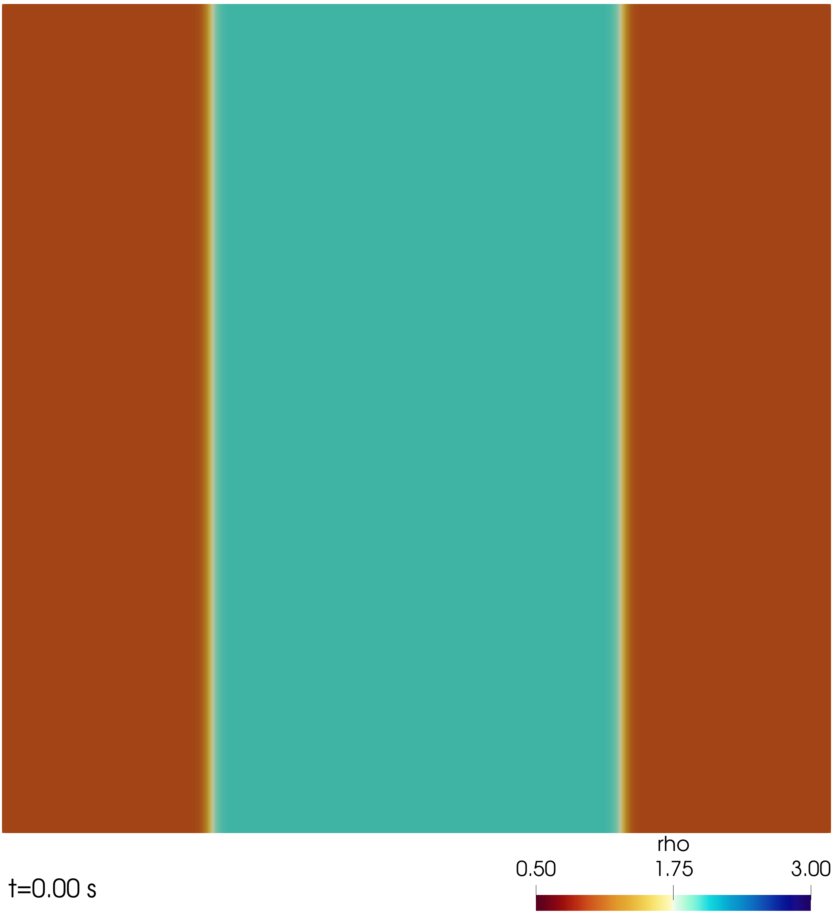

# WABBIT - RNS (reactive navier stokes physics)
## (W)avelet (A)daptive (B)lock-(B)ased solver for (I)nteractions with (T)urbulence

WABBIT-RNS is a fork from WABBIT, to implement separatly reactive navier stokes physics and other things. Due to heavy changes in some of the core routines, a merge with the WABBIT master branch would not be an easy task. But someday WABBIT-RNS will be synchronized again with the master.

New in comparison to WABBIT are:

+ reactive navier stokes physics
+ turbulence forcing

## INSTALL

1. clone from git

```
https://github.com/mario-sroka/WABBIT.git
```

2. install [MPI library](https://www.open-mpi.org/) 

3. install [HDF5 library](https://www.hdfgroup.org/downloads/hdf5/source-code/ "HDF5 Source Code")

	necessary variables for WABBIT
```
export HDF_ROOT=[...]
export LD_LIBRARY_PATH=$LD_LIBRARY_PATH:$HDF_ROOT/lib64
```

4. install [CANTERA library](https://www.cantera.org/), build FORTRAN module

	set up variables for WABBIT
```
export CANTERA_ROOT=[.../cantera_install]
export CANTERA_DATA=[.../cantera/data/inputs]
export PKG_CONFIG_PATH=[.../cantera_install/lib64/pkgconfig]
export PATH=$PATH:[.../cantera_install/bin]
export LD_LIBRARY_PATH=$LD_LIBRARY_PATH:$CANTERA_ROOT/lib64
```

## run WABBIT-RNS

Customize the .ini-files in CASES directory, run WABBIT with .ini-file name

```
wabbit [path_to_your_ini_filename.ini] 
```

where the --memory options allows you to approximately control how much memory is globally allocated, i.e., on all ranks. Note that WABBIT does not free memory which is once allocated again during runtime. This is because we intent to use clusters, where the globally available memory is reserved for the exectution.

## Test Cases



## Publications

* ["An Open and Parallel Multiresolution Framework Using Block-Based Adaptive Grids"](https://link.springer.com/chapter/10.1007%2F978-3-319-98177-2_19 "Sroka2018"); Sroka, Engels, Krah, Mutzel, Schneider, Reiss; Active Flow and Combustion Control 2018
